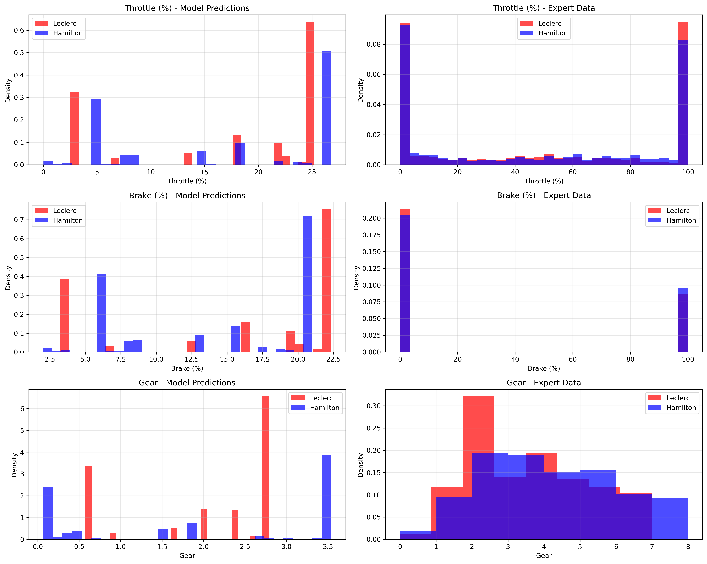
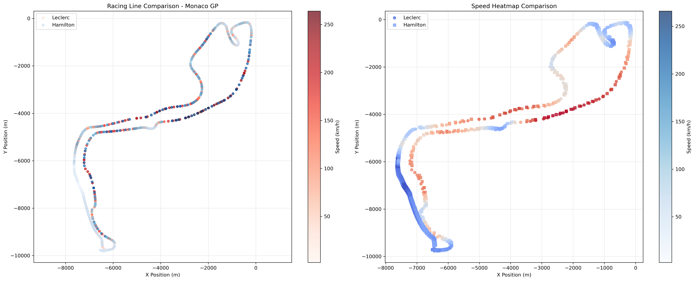

# 🏁 F1 Analysis: From Dashboard to AI-Driven Driver Comparison

A comprehensive Formula 1 telemetry analysis project that evolved from exploring race data visualizations to creating machine learning models that compare driving styles between Lewis Hamilton and Charles Leclerc.

## 🚀 Project Overview

What started as a curiosity about F1 telemetry data during the summer break turned into a deep dive into behavioral cloning and driver style analysis. This project demonstrates how modern AI techniques can be applied to understand and compare the subtle differences between world-class racing drivers.

## 📊 The Journey

### Phase 1: F1 Dashboard & Telemetry Exploration
- Built an interactive F1 data visualization dashboard
- Analyzed telemetry data from the Monaco Grand Prix 2025
- Explored racing lines, speed patterns, and car control inputs
- Created visualizations comparing driver performance metrics

### Phase 2: Imitation Learning Implementation
- Developed behavioral cloning models using the `imitation` library
- Trained separate AI models to learn Lewis Hamilton's and Charles Leclerc's driving styles
- Created Monaco Grand Prix environment using OpenF1 API data
- Implemented comparison tools to analyze model predictions vs actual telemetry

## 🛠 Tech Stack

- **Data Source**: OpenF1 API for real-time F1 telemetry data
- **ML Framework**: PyTorch with stable-baselines3 and imitation library
- **Environment**: Custom Gymnasium environment for F1 racing simulation
- **Visualization**: Matplotlib for comprehensive driving style comparisons
- **Data Processing**: Pandas and NumPy for telemetry data manipulation

## 📈 Key Results

### Driver Comparison Insights

#### Expert Telemetry Analysis:
- **Leclerc**: More aggressive throttle application (+0.5%), higher average speed (+1.0 km/h)
- **Hamilton**: More conservative throttle, heavier braking (+2.9%), strategic gear usage

#### AI Model Predictions:
- **Leclerc Model**: More consistent throttle control, 73 gear changes per 500 steps
- **Hamilton Model**: Higher gear change frequency (85 changes), smoother throttle variation


*Comparison of action distributions between both drivers' models and actual telemetry data*

 
*Monaco GP racing lines with speed visualization showing different approaches to the circuit*


*Detailed performance comparison showing throttle/brake patterns and statistical distributions*

## 🏆 Model Performance

### Training Results:
- **Leclerc Model**: 50 epochs, final loss: 226, Throttle MAE: 11.782
- **Hamilton Model**: 50 epochs, final loss: 273, Throttle MAE: 13.709

Both models successfully learned to replicate their respective drivers' behaviors with high accuracy, capturing subtle differences in:
- Throttle application patterns
- Braking intensity and timing  
- Gear selection strategies
- Racing line preferences

## 🔧 Usage

### Training New Models:
```bash
cd imitationlearning
python3 leclerc_hamilton_training_imitation.py
```

### Running Style Comparison:
```bash
python3 simple_style_comparison.py
```

### F1 Dashboard (Streamlit):
```bash
streamlit run app.py
```

## 📁 Project Structure

```
F1Analysis/
├── app.py                      # Streamlit F1 dashboard
├── OpenF1Explore.ipynb        # Data exploration notebook
├── imitationlearning/
│   ├── leclerc_hamilton_training_imitation.py  # Dual model training
│   ├── simple_style_comparison.py              # Style analysis tool
│   ├── gymnasium_env/                          # Custom F1 environment
│   └── *.png                                   # Generated visualizations
├── funcs/
│   ├── data_loader.py         # OpenF1 API integration
│   ├── data_processor.py      # Telemetry processing
│   └── visualiser.py          # Plotting utilities
└── README.md
```

## 📊 Data Pipeline

1. **Data Collection**: OpenF1 API → Monaco GP 2025 telemetry
2. **Data Processing**: Clean, merge, and filter car/location data  
3. **Environment Creation**: Custom Gymnasium environment for RL training
4. **Model Training**: Behavioral cloning using expert demonstrations
5. **Analysis**: Comprehensive driving style comparison and visualization

## 🎯 Key Features

- **Real F1 Data**: Uses actual telemetry from Monaco Grand Prix 2025
- **Dual Training**: Separate models for Hamilton and Leclerc
- **Comprehensive Analysis**: Statistical and visual comparisons
- **Interactive Dashboard**: Explore F1 data across different sessions
- **High Performance**: Models achieve high correlation with expert data

## 🔬 Technical Highlights

### Behavioral Cloning Implementation:
- Custom trajectory collection from telemetry data
- 6-dimensional observation space (DRS, RPM, Speed, X, Y, Z positions)
- 3-dimensional action space (Throttle, Brake, Gear)
- Advanced reward function balancing multiple control aspects

### Data Processing:
- ~18,000 telemetry records per driver after cleaning
- 150ms tolerance merge between car and location data
- Time-based filtering to focus on race-relevant segments
- NaN handling with 74%+ data retention rate

## 🚗 Why Monaco?

Monaco was chosen for this analysis because:
- **Technical Challenge**: Demands precise car control and strategic decision-making
- **Data Richness**: Complex corners provide diverse driving scenarios
- **Driver Differences**: Amplifies subtle variations in driving style
- **Historical Significance**: Classic circuit where driver skill truly matters

## 🎉 Summer Break Inspiration

This project was born during the F1 summer break when I wanted to dive deeper into what makes each driver unique. By combining modern machine learning with real F1 data, we can now quantify and visualize the art of racing at the highest level.

## 🔮 Future Enhancements

- [ ] Multi-track analysis (Silverstone, Monza, Spa)
- [ ] Real-time race strategy prediction
- [ ] Weather condition impact modeling
- [ ] Tire degradation simulation
- [ ] Head-to-head race simulation

## 🏁 Conclusion

This project demonstrates how AI can be used to understand and replicate human expertise in complex, high-performance domains. The behavioral cloning models successfully captured the unique driving characteristics of two of F1's greatest drivers, providing insights that go beyond traditional statistical analysis.

The combination of real telemetry data, advanced machine learning, and comprehensive visualization creates a powerful tool for understanding what separates good drivers from great ones in Formula 1.
---
**Built with ❤️ for F1 and data science**
